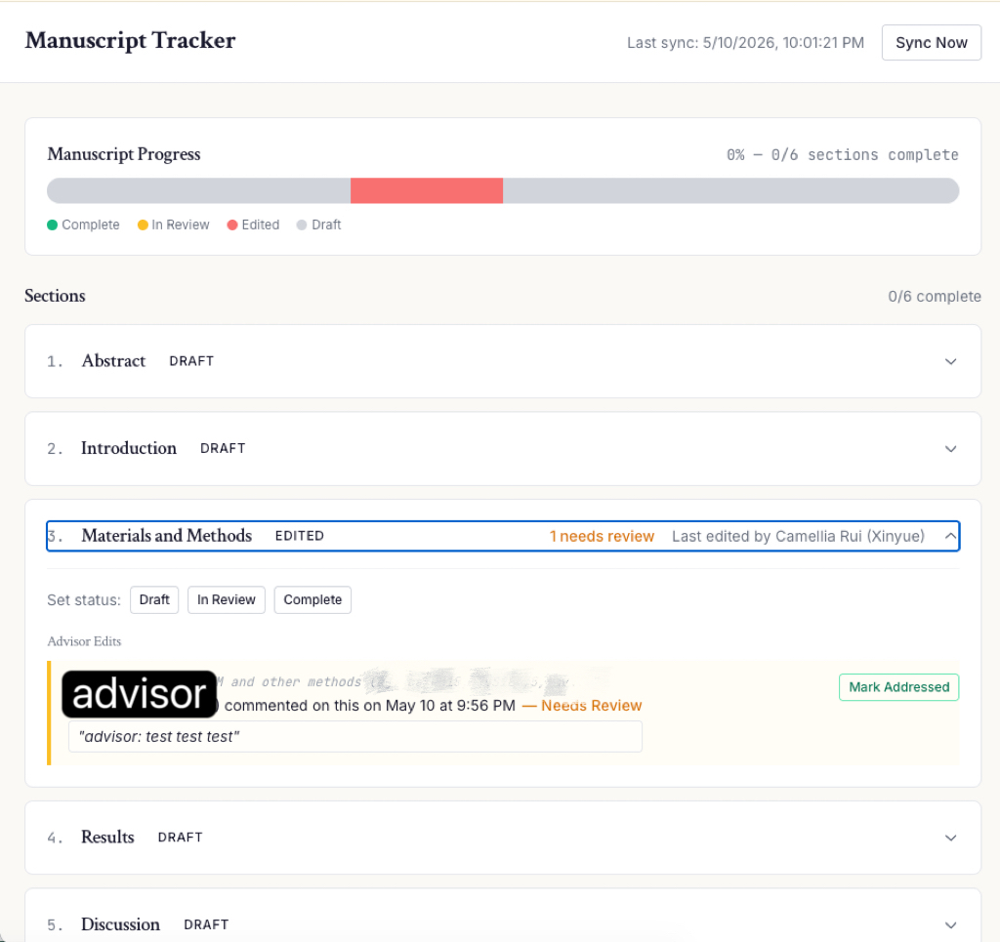

# Manuscript Tracker

Automatically sync your Google Doc comments/edits with a progress dashboard. Never lose track of advisor feedback again.


**How it works:**

1. Your advisor edits or comments on your manuscript in Google Docs
2. The tracker picks up the changes and shows them as a checklist
3. You address the feedback and revise — the system marks items as done
4. A progress bar shows how far each section is from completion



## Features

- **Google Docs sync** — automatically detects text edits and comments from advisors every 15 minutes
- **Section tracking** — monitors 6 manuscript sections (Abstract, Introduction, Materials & Methods, Results, Discussion, Supplement)
- **Paragraph-level annotations** — shows exactly which paragraphs were edited or commented on, by whom, and when
- **Progress bar** — visual overview of manuscript completion (each section = ~16.7%)
- **Comment tracking** — advisor comments from Google Docs appear as annotations with the comment text
- **Mark as addressed** — resolve annotations from the dashboard or by editing the paragraph in Google Docs
- **Activity timeline** — chronological feed of all edits, comments, and progress updates
- **Progress logging** — manually log your own progress with notes per section

## Tech Stack

- **Frontend:** React + Vite + Tailwind CSS (academic minimalist design)
- **Backend:** Cloudflare Workers (API + cron sync)
- **Database:** Cloudflare D1 (SQLite)
- **APIs:** Google Docs API + Google Drive API
- **Hosting:** Cloudflare Pages + Workers

## Setup

### Prerequisites

- [Node.js](https://nodejs.org/) v18+
- A [Cloudflare](https://cloudflare.com) account (free tier works)
- A [Google Cloud](https://console.cloud.google.com) project

### 1. Clone and install

```bash
git clone https://github.com/CamelliaRui/manuscript-tracker.git
cd manuscript-tracker
npm install
cd frontend && npm install && cd ..
```

### 2. Google Cloud setup

**Create a service account:**

1. Go to [Google Cloud Console](https://console.cloud.google.com)
2. Create a new project (or select an existing one)
3. Enable **Google Docs API** and **Google Drive API** in APIs & Services > Library
4. Go to APIs & Services > Credentials > + Create Credentials > Service Account
5. Name it `manuscript-tracker-sync`, click Create and Continue, skip optional steps
6. Click on the created service account > Keys tab > Add Key > Create new key > JSON
7. Save the downloaded JSON file

**Share your Google Doc:**

1. Open your manuscript Google Doc
2. Click Share
3. Paste the service account email (from the JSON file, ends in `@...iam.gserviceaccount.com`)
4. Set access to **Editor** (needed to post/resolve comments)
5. Uncheck "Notify people" > Share

**Get your Google Doc ID** from the URL:

```
https://docs.google.com/document/d/YOUR_DOC_ID_HERE/edit
```

### 3. Cloudflare setup

**Log in to Cloudflare:**

```bash
npx wrangler login
```

**Create the D1 database:**

```bash
npx wrangler d1 create manuscript-tracker-db
```

Note the `database_id` from the output.

**Configure the project:**

```bash
cp wrangler.toml.example wrangler.toml
```

Edit `wrangler.toml` with your values:

```toml
[[d1_databases]]
database_id = "your-d1-database-id"

[vars]
GOOGLE_DOC_ID = "your-google-doc-id"
OWNER_EMAIL = "your-email@example.com"
OWNER_EMAILS = "your-email@example.com,your-other-email@gmail.com"
OWNER_DISPLAY_NAMES = "Your Name,Your Display Name"
```

- `OWNER_EMAILS` — comma-separated list of all your email addresses. Edits from these are treated as yours (not flagged as advisor edits).
- `OWNER_DISPLAY_NAMES` — comma-separated list of your Google display names. Used to identify your comments when Google doesn't return your email.

**Store the service account key:**

```bash
cat path/to/your-key.json | npx wrangler secret put GOOGLE_SERVICE_ACCOUNT_KEY
```

**Run the database migration:**

```bash
npx wrangler d1 execute manuscript-tracker-db --remote --file=migrations/0001_init.sql
```

### 4. Configure the frontend

```bash
cp frontend/.env.example frontend/.env
```

Edit `frontend/.env`:

```
VITE_API_URL=https://your-worker-name.your-subdomain.workers.dev
VITE_OWNER_EMAIL=your-email@example.com
```

You'll get the worker URL after deploying in the next step.

### 5. Deploy

**Deploy the worker:**

```bash
npx wrangler deploy
```

Note the URL printed (e.g., `https://manuscript-tracker-api.yourname.workers.dev`) and update `VITE_API_URL` in `frontend/.env`.

**Build and deploy the frontend:**

```bash
cd frontend
npm run build
npx wrangler pages project create your-project-name --production-branch production
npx wrangler pages deploy dist --project-name your-project-name --branch production
```

### 6. Initial sync

Trigger the first sync to capture your current document as a baseline:

```bash
curl -X POST https://your-worker-url.workers.dev/sync
```

After this, the cron job will sync every 15 minutes automatically.

## Local Development

```bash
# Terminal 1: run the API worker locally
npx wrangler dev

# Terminal 2: run the frontend dev server
cd frontend && npm run dev
```

The frontend runs at `http://localhost:5173` and proxies API requests to the worker at `http://localhost:8787`.

## Customizing Sections

The default sections are: Abstract, Introduction, Materials & Methods, Results, Discussion, Supplement.

To customize, edit the section definitions in:
- `workers/shared/doc-parser.ts` — heading patterns for parsing
- `migrations/0001_init.sql` — seed data for the database

The parser matches section headings in your Google Doc (e.g., a heading starting with "Introduction" maps to the Introduction section).

## License

MIT
